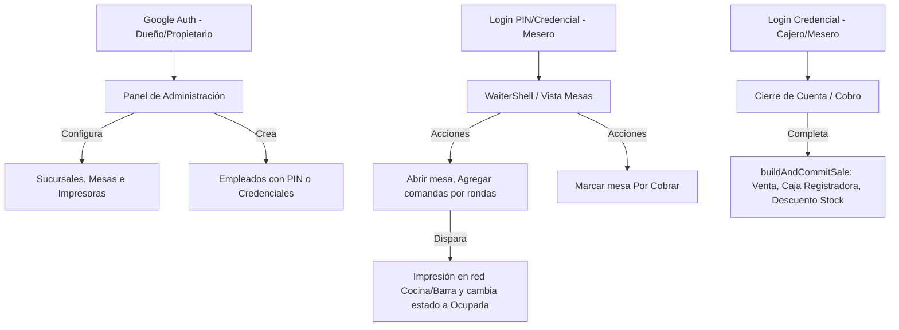

# Guía de Pruebas y Funcionamiento de LOGIC POS Restaurantes

Esta guía describe cómo funciona (o debe funcionar) el proyecto **LOGIC POS Restaurantes**, los roles involucrados, la sincronización en tiempo real y el flujo paso a paso que debes seguir para realizar pruebas completas y verificar su correcto funcionamiento.

---

## 🗺️ 1. Arquitectura y Roles del Sistema

LOGIC POS Restaurantes es una especialización de punto de venta gastronómico diseñada para operar con sincronización en tiempo real mediante **Firebase (Firestore & Auth)**. El sistema adapta su interfaz y sus permisos dinámicamente según el rol del usuario autenticado:



### Roles Disponibles
1. **Dueño (Owner) / Administrador (Admin):**
   - Acceso total a todas las secciones.
   - Configuración de sucursales, creación de catálogo de productos, registro de proveedores e inventarios.
   - Creación y edición de empleados (Meseros, Cajeros, Administradores).
   - Configuración de impresoras ESC/POS (IP/Puerto para Cocina y Barra).
   - Panel de Auditoría y Estadísticas.
2. **Cajero (Employee / Cajero):**
   - Acceso a caja registradora (apertura, retiros, depósitos y cierre de turno).
   - Realización de ventas directas y cobros de mesas/comandas.
   - Visualización del historial de ventas y movimientos de inventario de su sucursal.
3. **Mesero (Waiter):**
   - Acceso restringido a través de la interfaz simplificada `WaiterShell.tsx`.
   - Inicia sesión rápidamente mediante un PIN táctil de empleado.
   - Ve el mapa de mesas (`TablesFloorView.tsx`) y toma comandas (`ComandaView.tsx`).
   - Envía rondas a imprimir y cambia el estado de las mesas. No puede modificar catálogo ni ver reportes o auditoría.

---

## 🍽️ 2. Flujo de Operación Gastronómica

El ciclo de vida de una mesa y su comanda sigue estos estados en Firestore:

```
[Libre] ──(Abrir Mesa)──> [Ocupada] ──(Rondas de Comida/Bebida)──> [Por Cobrar] ──(Cobro/Pago)──> [Libre (Orden Cerrada)]
```

### 1. Apertura de Mesa e Inicio de Orden
- Al seleccionar una mesa en estado **Libre** e iniciar una comanda, se crea un documento en la subcolección `orders` con `status: "open"`.
- La mesa cambia su `status` a `"ocupada"` y su `currentOrderId` apunta a la nueva orden.

### 2. Adición de Rondas e Impresión Dividida (ESC/POS)
- El mesero selecciona artículos y los añade a la ronda actual.
- Al presionar **"Enviar a Cocina / Barra"**:
  - Los productos nuevos se agrupan según su destino (`printDestination`: `"cocina"`, `"barra"` o `"ninguno"`).
  - Si se ejecuta en la app Android nativa (Capacitor), se disparan los comandos de impresión en red TCP directamente a las IPs configuradas en el módulo de impresoras.
  - En la web, se simula el envío y se marca la ronda como enviada (se guarda la fecha de envío en `sentAt`).
  - La ronda actual se vacía y se consolida en la lista histórica de la comanda.

### 3. Solicitud de Cuenta ("Por Cobrar")
- Cuando los comensales terminan, el mesero marca la mesa como **"Por Cobrar"** desde la interfaz de comandas.
- El estado de la mesa cambia a `"por_cobrar"`. Visualmente en el mapa de mesas, la mesa se tiñe de color amarillo o alerta, avisando a caja que requiere atención.

### 4. Cierre de Mesa (Cobro y Venta)
- El cobro puede ser efectuado por el mesero (si tiene permisos) o el cajero de turno.
- Se selecciona el método de pago (Efectivo, Tarjeta, Transferencia, Crédito/Fiado).
- Al confirmar el cobro, se ejecuta la función atómica `buildAndCommitSale`:
  - Crea un documento `Sale` en Firestore.
  - Actualiza el saldo en caja (si es pago en efectivo, agrega el monto a `currentCash` en `cashRegisters`).
  - Resta la cantidad correspondiente de stock del catálogo (`branchStocks[branchId]`).
  - Cambia el estado de la orden (`Order`) a `"closed"` y le enlaza el `saleId`.
  - Libera la mesa: cambia su estado a `"libre"` y su `currentOrderId` a `null`.

---

## 🧪 3. Guía Paso a Paso para Probar el Proyecto

Para hacer un QA completo de la aplicación localmente, sigue estos pasos estructurados:

### ⚠️ Prerrequisitos
1. **Ejecutar el servidor local:**
   Asegúrate de que la terminal tenga el dev server corriendo:
   ```bash
   npm run dev
   ```
2. **Abrir en el navegador:**
   Ingresa a [http://localhost:3000](http://localhost:3000).

---

### Paso A: Creación de la Cuenta Administradora y Configuración Inicial
1. **Registro:** Inicia sesión con una cuenta de Google (o con el flujo de prueba local).
2. **Configuración de Negocio:**
   - Ve a la pestaña **Configuración** (`settings`).
   - Asegúrate de cambiar el **Giro de Negocio** a **Restaurante** (esto activará la pestaña de **Mesas** en lugar del POS directo de retail).
3. **Creación de Sucursales:**
   - Ve a la pestaña **Sucursales** (`branches`).
   - Crea al menos dos sucursales (por ejemplo: "Matriz Centro" y "Sucursal Norte") para poder probar transferencias de inventario más adelante.
4. **Diseño del Mapa de Mesas:**
   - Regresa a la pestaña **Mesas** (`tables`).
   - Crea mesas asignando nombres (ej. "Mesa 1", "Mesa 2"), capacidad de personas y zona (ej. "Principal", "Terraza", "VIP").
5. **Configuración de Impresoras (Fase 5):**
   - Ve a la pestaña **Configuración > Impresoras**.
   - Ingresa IPs ficticias o reales (ej. `192.168.1.200` puerto `9100`) para la impresora de Cocina y Barra.
   - Presiona el botón "Probar Impresora". En navegador web deberá mostrar una alerta informativa indicando que la impresión directa requiere la app de Android (Capacitor).

---

### Paso B: Carga de Catálogo e Inventario
1. **Agregar Productos:**
   - Ve a la pestaña **Productos** (`products`).
   - Agrega varios productos asignando precios de costo y venta.
   - **Crucial para Restaurante:** Define la **Estación de Impresión** (`printDestination`) en el formulario:
     - Asigna "Tacos", "Hamburguesas" o platos a **Cocina**.
     - Asigna "Refrescos", "Cervezas" o bebidas a **Barra**.
     - Deja otros artículos sin destino ("Ninguno").
2. **Carga de Stock inicial:**
   - Realiza un "Surtido" (Restock) de productos en la sucursal activa.
   - Revisa que en el historial de inventario se refleje el movimiento como un tipo `surtido`.

---

### Paso C: Gestión de Personal (PIN de Mesero)
1. **Crear Mesero y Cajero:**
   - Ve a la pestaña **Configuración > Empleados**.
   - Haz clic en **"Registrar Empleado"**.
   - Crea un empleado con rol **Mesero** (ej. "Juan Pérez") y asígnale un PIN numérico (mínimo 6 dígitos, ej. `123456`).
   - Crea un empleado con rol **Cajero** (ej. "Sofía Gómez") y dale un PIN (ej. `654321`).
2. **Cerrar Sesión Administradora:**
   - Presiona el botón de **Cerrar Sesión** en la barra superior.

---

### Paso D: Pruebas del Rol Mesero (Flujo del Comensal)
1. **Pantalla de PIN (EmployeePinLogin.tsx):**
   - El sistema te mostrará la pantalla con el teclado táctil numérico de personal.
   - Introduce el PIN del mesero creado (`123456`) usando el pad visual o el teclado de tu computadora.
   - Comprueba que tras ingresar el PIN correcto, el sistema te redirija a la vista simplificada **WaiterShell**.
2. **Seleccionar Sucursal:**
   - Selecciona la sucursal en la que trabajará el mesero (ej. "Matriz Centro").
3. **Mapeo de Mesas:**
   - En el mapa de mesas, comprueba que se visualicen las mesas que creaste en el Paso A.
   - Comprueba los filtros de zona ("Principal", "Terraza", "VIP") y filtros de estado ("Todas", "Libre").
4. **Abrir Cuenta:**
   - Haz clic sobre la "Mesa 1".
   - Presiona **"Abrir Mesa / Iniciar Comanda"**.
   - Verifica que el estado de la mesa cambie instantáneamente a **Ocupada** (color azul/verde de ocupación).
5. **Agregar e Imprimir Rondas:**
   - Selecciona productos del catálogo y agrégalos a la comanda (ej. 2 Tacos y 1 Refresco).
   - Observa que se listen en la sección "Ronda Actual".
   - Presiona **"Enviar a Cocina / Barra"**.
   - Verifica que los productos pasen al historial de la comanda con una etiqueta de enviado y desaparezcan de la "Ronda Actual".
   - Intenta agregar una nueva ronda (ej. 1 Cerveza) y vuelve a enviarla.
6. **Pedir Cuenta (Por Cobrar):**
   - Haz clic en el botón **"Pedir Cuenta / Marcar Por Cobrar"** en la comanda.
   - Cierra la vista de comanda y observa el mapa de mesas: la "Mesa 1" debe estar pintada de color amarillo ("Por Cobrar").
7. **Cerrar Sesión de Mesero:**
   - Presiona "Cerrar Turno / Salir" para volver a la pantalla de PIN.

---

### Paso E: Pruebas del Cierre de Turno y Cobro (Rol Cajero)
1. **Iniciar Sesión como Cajero:**
   - En la pantalla de PIN, introduce el PIN del cajero (`654321`).
2. **Apertura de Caja (Turno):**
   - El sistema debe pedirte la apertura de la caja registradora. Ingresa un saldo inicial (ej. `$1,000.00 MXN`).
3. **Cobrar Mesa:**
   - Ve a la pestaña **Mesas**.
   - Verás la "Mesa 1" marcada en amarillo ("Por Cobrar").
   - Selecciona la mesa y presiona **"Cobrar Cuenta"**.
   - Selecciona el método de pago (ej. Efectivo con billete de `$500.00` para validar el cálculo del cambio).
   - Presiona **"Completar Venta"**.
4. **Verificación de Efectos del Cobro:**
   - **Mesa Libre:** Regresa al mapa de mesas; la "Mesa 1" ahora debe figurar de color verde/gris como **Libre** y lista para una nueva orden.
   - **Descuento de Stock:** Ve al catálogo de productos y verifica que las unidades vendidas (ej. 2 Tacos y 1 Refresco) se hayan descontado correctamente del inventario de esa sucursal.
   - **Flujo de Caja:** Revisa en la sección de Caja que el total cobrado en efectivo se haya sumado al efectivo actual (`currentCash`) y se liste la transacción.

---

### Paso F: Auditoría y Estadísticas (Rol Administrador/Dueño)
1. **Regresar al Administrador:**
   - Cierra sesión de cajero e inicia sesión con la cuenta administradora de Google.
2. **Verificar Auditoría (`AuditView.tsx`):**
   - Ve a la pestaña **Auditoría** (`audit`).
   - Aplica los filtros de fecha, sucursal y mesero.
   - Verifica que aparezca el cobro de la mesa asociada al mesero "Juan Pérez", indicando la hora, productos vendidos y método de pago.
3. **Ver Estadísticas (`analytics`):**
   - Revisa que los gráficos de ventas muestren el volumen transaccionado del día.

---

## 🔍 4. Aspectos Críticos a Revisar durante el Testing

Cuando estés realizando las pruebas funcionales, pon especial atención a los siguientes detalles:

| Componente / Proceso | Qué revisar específicamente | Comportamiento Esperado |
|---|---|---|
| **Pin Pad (`EmployeePinLogin`)** | Intentar ingresar con PINs menores a 6 dígitos o inexistentes. | El botón de submit debe bloquearse si no se alcanza la longitud mínima, y arrojar error amigable si el PIN es incorrecto. |
| **Cambios en Caliente (Firestore Sync)** | Abre el sistema en dos pestañas diferentes (o una pestaña de navegador y un celular) al mismo tiempo en la misma sucursal. Abre una mesa en una de ellas. | La mesa debe aparecer automáticamente como **Ocupada** en la otra pestaña en menos de 1 segundo sin necesidad de recargar la página. |
| **Deltas de Stock** | Intenta vender un producto que tenga 0 de stock. | Si la sucursal no permite stock negativo, el sistema debe alertar y bloquear el envío. Si lo permite, debe descontar y quedar en negativo. |
| **Transacciones de Caja** | Realizar retiros de caja (retiros parciales) y comprobar que el balance final cuadre con las ventas del día. | `currentCash` debe recalcularse dinámicamente. |
| **Filtro de Sucursales** | Cambia de sucursal en la barra superior. | Las mesas mostradas, las comandas activas, el stock y la caja registradora deben filtrarse estrictamente para la sucursal seleccionada. |

---

## 🛠️ 5. Pruebas Técnicas y de Base de Datos (Firestore Rules)

El archivo [`firestore.rules`](file:///c:/Users/usuario/OneDrive/Desktop/logic_pos_restaurantes/firestore.rules) contiene reglas de seguridad estrictas que impiden escrituras maliciosas. 

Si deseas validar las reglas localmente usando el **Firebase Emulator Suite**:
1. Asegúrate de tener instalado el Firebase CLI.
2. Inicia los emuladores:
   ```bash
   firebase emulators:start
   ```
3. Ejecuta pruebas unitarias de seguridad para confirmar que un rol `mesero` o `employee` **no pueda**:
   - Modificar precios de productos.
   - Eliminar una sucursal (`branches/{branchId}`).
   - Leer/Escribir datos de otra compañía (`companies/{companyId}`).
   - Borrar registros de ventas pasadas (`sales/{saleId}`).
